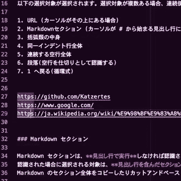

# Midas Select : VS Code Smart Selector


----

[](https://github.com/katzertes/midas-select)

**単独のショートカットキー**で文脈判断による範囲選択を自動的に行う VSCode 拡張機能です。
連続で使うと選択対象が循環式で次 (ある場合) に移ります。

```text
URL > Markdownセクション > 括弧内ブロック > インデントブロック > 空行ブロック > 段落(空行仕切)
```

また、選択後の自動コピーなどを各選択対象に個別設定する事ができます。
スキルや環境を問わず即座に導入・実用でき、テキストファイル全般に汎用的に使えるというコントセプトです。
- Default Shortcut:
<kbd>Cmd</kbd><kbd>Opt</kbd> + <kbd>E</kbd> on Mac
<kbd>Ctrl</kbd><kbd>Alt</kbd> + <kbd>E</kbd> on Windows



----

## 📑選択対象

以下の選択対象が自動的に選択されます。連続使用すれば循環的に次の対象を探索します。

1. URL (カーソルがその上にある場合)
2. Markdownファイルにおいて、カーソルが # から始まる見出し行にある場合
   1. 見出し行を含めたセクション全体
   2. 見出し行を含まないセクション全体
3. 括弧内ブロック
   1. 括弧記号の内部 (括弧記号を含まない)
   2. 括弧記号を含んだブロック全体
4. インデントブロック
5. 連続する空行全体
6. 段落 (空行を仕切りとした連続した行のブロック)
   1. 段落全体 (カーソル行から遡って認識する)
   2. カーソル行から次の空行まで

### #️⃣Markdown セクション

Markdown セクションは、**見出し行で実行**しなければ選択対象として認識されません。

認識された場合に最初に選択される対象は見出し行を含んだセクション全体です。
Markdown のセクション全体をコピーしたりカットアンドペーストしたい時に対象となるでしょう。
連続実行して第二候補として選択されるのが見出し行を含まないセクション全体です。

### 🔣括弧内ブロック

カーソルがその中にある場合、括弧記号で挟まれたテキストが選択されます。
連続実行すると、括弧記号も含めて選択します。

#### 🔤対応している括弧記号
```text
ASCII brackets:
( ) [ ] { } < >
Full-width:
（ ） ［ ］ ｛ ｝ ＜ ＞
〈 〉 《 》 « »
Full-width for Japanese:
「 」 『 』 〔 〕 【 】
```

### ↔️インデントブロック

インデントとは、皆さんご存知の通り、一般には、空白やタブを行頭に挿入する事です。
たとえば、プログラム言語の Python では、インデントそのものがブロックとして扱われます。
```c
    // indent
    // indent
// no indent
// no indent
```
しかし当拡張機能はプログラムのソースコード専用ではないので「行頭に同じ連続文字が続く行」も選択対象です。
従って、
```text
>> たとえば、引用符もインデントとして扱われる。
>> ここで実行すれば、>> から始まる行だけが選択される。
>> と、というわけです。
よって、以下のような場合も行頭に同じ文字が揃っているので、インデント扱いになる。
「私は、風である。」
「あなたは、炎である。」
ただし、この場合「」の内部で実行すると、
最初は括弧の内部が選択され、連続実行する事で会話文の連続が選択されます。
```

----

## ⚙️設定

範囲選択操作に続けてコピー等の指定の追加動作が自動的に行われるように設定する事ができます。

常用できるオススメの設定は以下です。
- MarkDown Content : copy
- Paragraph : copy

###

`Copy`以外の設定を行う場合は、下記にご注意ください:

* ⚠️`None` `Copy` 以外の追加機能を設定すると、循環的選択ができません。
恒常的な設定として推奨できるのは、非破壊的操作であるコピーだけです。他のアクションは選択範囲を変形させるので、連続使用による循環的な選択はリセットされます。マクロ操作として、連続した定型作業が必要な時に一時的に設定して使う機能と考えてください。

* ⚠️コメントのトグル目的では使えません
`Comment Apply` を設定した場合、コメント化・コメント解除によって選択対象のテキストが変化します。選択対象は文脈判断により決まるため、Midas Select を連続使用する事によるコメントのトグルは保証されません。

